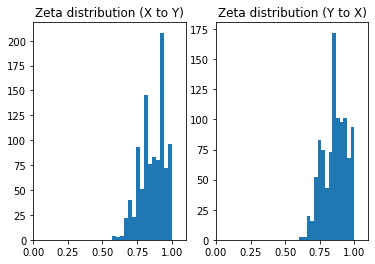

Welcome to llcf-test's documentation!
=====================================

The llcf-test package is a Python-based implementation of a statistical hypothesis test
for the existence of a locally Lipschitz continuous function between two random
vectors.

.. contents:: Navigation
   :depth: 3
   :local:

Installation
------------
The easiest way to install llcf-test is to let PIP do the work, simply by running

.. code-block::

   pip install llcf-test

Another possible way is to clone the `GitHub repository <https://github.com/adam-zlatniczki/llcf-test-python>`_,
navigate in a command line tool to where *setup.py* is, then run

.. code-block::

   pip install .

Reference
---------

.. automodule:: llcf_test.bootstrap
    :members:

.. automodule:: llcf_test.graphics
    :members:

.. automodule:: llcf_test.zeta
    :members:

Examples
--------

Simple introduction
^^^^^^^^^^^^^^^^^^^
Using the test can be pretty straightforward. First, let's generate some sample data where :math:`Y = 4X^2+3` and :math:`X
\in U(-1,1)` by running

.. code-block:: python

   import numpy as np
   import llcf_test

   np.random.seed(0)
   n = 1000

   X = np.random.uniform(low=-1.0, high=1.0, size=n).reshape(-1,1)
   Y = 4*X**2 + 3

We can construct the confidence intervals for the test as

   >>> llcf_test.conf_ints(X, Y)
   ((1.0, 1.0), (0.0, 0.0020999999999999942))

The first tuple represents the confidence interval for testing :math:`Y = f(X)`, and the second tuple represents the
confidence interval for testing :math:`X = g(Y)`. We can see that 1 is inside the confidence interval in the first case,
but not in the second. This means that at the (default) 0.05 significance level we accept the null-hypothesis that there
exists a locally Lipschitz continuous function :math:`f` such that :math:`P(Y = f(X)) = 1`, and we reject the hypothesis
that there exists a locally Lipschitz continuous :math:`g` such that :math:`P(X = g(Y)) = 1`. This matches our
expectations perfectly.

Effect of normalization
^^^^^^^^^^^^^^^^^^^^^^^
Normalization can have a very significant effect on the outcome. Since the :math:`\hat{\zeta}` statistic relies on
nearest neighbor search, it's performance evidently degrades if there are differences in the scale of the variables.
To counter this, normalization should be used. However, the kind of normalization does matter a lot. For example,
min-max scaling keeps the local Lipschitz property, but it's only a linear transform. On the other hand, rank
normalization is a non-linear transform, but it keeps the local Lipschitz property only asymptotically, so if the sample
size is not large it may introduce issues. Similar arguments could be made about a plethora of different kinds of
normalization: it may very well happen that a specific method would be best to use in some situation, but maybe it would
shift the confidence interval somewhat. This case can be handled by defining some tolerance level :math:`\gamma` and
changing our strategy to test :math:`H_0^{\gamma}`.

Let's say we have a hunch that rank normalization would help - running the test we get

  >>> llcf_test.conf_ints(X, Y, autoscale="rank")
  ((0.96995, 0.98805), (0.002, 0.013049999999999996))

We can see that 1 is not inside the confidence intervals, so we reject :math:`H_0` in both directions. The reason
why we arrive at a different conclusion this time is due to the "small" sample size, which makes rank normalization a
too coarse approximation of the cumulative distribution function. Judging by the first confidence interval, it didn't do
too bad of a job though - introducing some low level of tolerance should make it acceptable. Let's set
:math:`\gamma = 0.05` and run the test again

  >>> llcf_test.conf_ints(X, Y, autoscale="rank", gamma=0.05)
  ((1.0, 1.0), (0.0, 0.0))

Now 1 lies inside the first confidence interval, so we can accept :math:`H_0^{\gamma}` from X to Y.

Normalization can really make a difference
^^^^^^^^^^^^^^^^^^^^^^^^^^^^^^^^^^^^^^^^^^
In the simple examples before, the choice of normalization didn't really matter (apart from needing to specify some
level of tolerance). However, here's an example dataset of a linear embedding from 2D to 3D where only one of the
normalization methods gives us the proper answer.

.. code-block:: python

   np.random.seed(0)
   n = 1000

   A = np.array([[0.2, 0.4, 0.4],
                 [0. , 0.4, 0.6]])

   X = np.random.uniform(size=(n,2))
   Y = np.dot(X, A)

Running our test with min-max scaling gives

>>> llcf_test.conf_ints(X, Y, autoscale="minmax")
((1.0, 1.0), (nan, nan))

Based on these confidence intervals, it seems pointless to introduce tolerance. However, if we simply change to rank
normalization we get

>>> llcf_test.conf_ints(X, Y, autoscale="rank")
((0.997475, 1.0), (0.998, 1.0))

In this case, we can accept :math:`H_0` in both directions, we don't even need to allow tolerance.

It may seem contradicting how a simple linear embedding couldn't be identified with min-max scaling. The reason is quite
simple though: the qhull implementation of the high-dimensional QuickHull algorithm raises an error when the convex
hull that it's building seems to be lower dimensional (in a linear sense) than the space itself. In such a case, a
nonlinear scaling can help a lot - that's why rank normalization got the job done. Another effect at work is that due to
the sample size being small, rank normalization introduces some noise-like perturbation as well, widening the confidence
intervals. The techniques discussed in the next section can help identifying such cases.

Getting a better understanding of the local properties
^^^^^^^^^^^^^^^^^^^^^^^^^^^^^^^^^^^^^^^^^^^^^^^^^^^^^^
If the tests show significance, we can more-or-less be happy. However, in real datasets noise is more than expected. An
unfortunate property of noise is that it practically ruins the local Lipschitz property. However, the
:math:`\hat{\zeta}` estimators may still give some hint about the deviance. For this reason, it could be useful to plot
their histogram. We can do this simply by running

>>> llcf_test.plot_zeta_histograms(X, Y)

In the linear embedding case above, we would see an error message, plus the histogram on the right would be missing,
indicating that the :math:`\hat{\zeta}` estimators could not be calculated - which happens when *qhull* ran into an
issue.

To see the histograms work, let's generate a noisy quadratic relationship

.. code-block:: python

    np.random.seed(0)
    n = 1000

    X = np.random.normal(size=(n,1))
    Y = 4*X + 3
    Y +=  0.1*np.random.normal(size=(n,1))

Running

>>> llcf_test.plot_zeta_histograms(X, Y)

should result in the following figure:

We can see that the zetas are skewed towards 1.0, indicating the possible existence of some sort of relationship, masked
by noise.

Dealing with noise
^^^^^^^^^^^^^^^^^^
If analysis of the zeta histograms shows signs of a locally Lipschitz continuous mapping with some added noise, then
we can approach it in the usual way: filter/reduce the noise. However, some thought should be given to the method of
filtering. If there is some sort of relationship, then the joint space should be an embedding of a manifold that describes
the relationship. Conceptually, the extra noise probably works on this manifold, distorting it. We should aim at methods
that smooth the geometry itself. For example, local averaging is a simple, yet effective tool for such tasks. To see this
in action, consider the following `Jupyter notebook <https://github.com/adam-zlatniczki/llcf-test-python/blob/main/notebooks/noise_analysis.ipynb>`_.

Indices and tables
==================

* :ref:`genindex`
* :ref:`modindex`
* :ref:`search`
